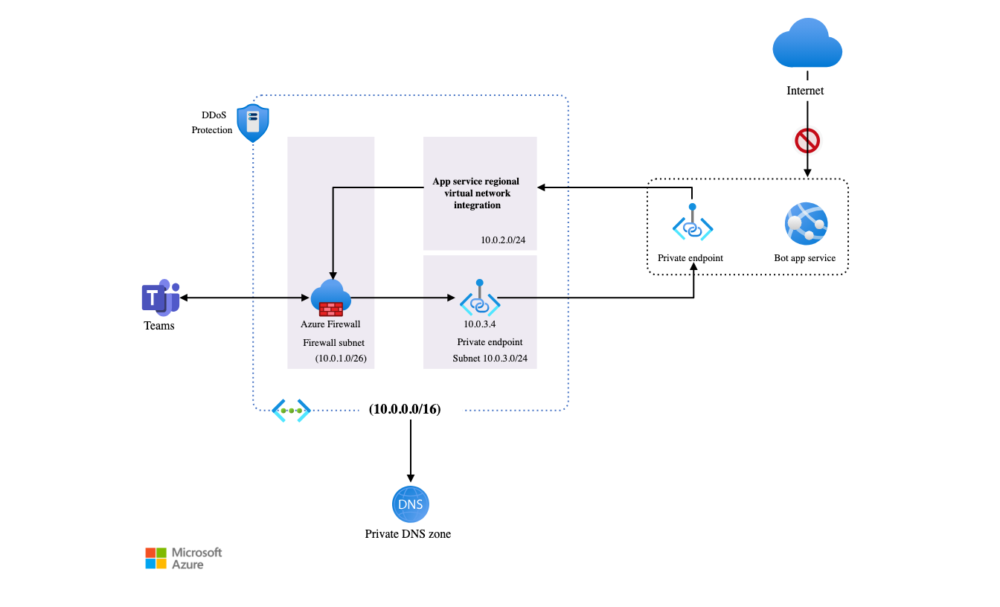
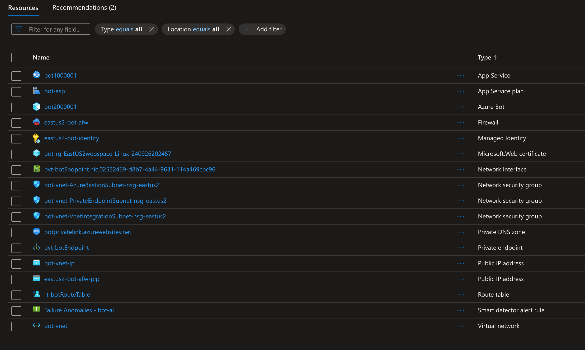

# Secure Bot

This scenario demonstrates how to secure a Microsoft Teams channel bot's web app using Azure Private Link and Azure Private Endpoint. It also shows how to enable communication between Teams client channels and the bot via an IP exposed through an Azure Firewall instance.

Architecture



Deployed resources



## References

The python bot code examples referenced in this doc do not work. The configs and code are not up to date, there are missing variables.

* https://learn.microsoft.com/en-us/azure/architecture/example-scenario/teams/securing-bot-teams-channel

Code pulled from the following example

* https://github.com/microsoft/BotBuilder-Samples/blob/main/samples/python/02.echo-bot/README.md
* https://learn.microsoft.com/en-us/azure/bot-service/dl-network-isolation-how-to?view=azure-bot-service-4.0&tabs=network

### Networking

* https://learn.microsoft.com/en-us/answers/questions/1476271/how-is-traffic-routed-between-subnets-in-same-azur
* https://learn.microsoft.com/en-us/azure/firewall/tutorial-firewall-deploy-portal

### Debugging

* https://learn.microsoft.com/en-us/azure/bot-service/bot-service-debug-channel-devtunnel?view=azure-bot-service-4.0
* https://learn.microsoft.com/en-us/azure/developer/dev-tunnels/get-started?tabs=linux

### Firewall

* https://techcommunity.microsoft.com/t5/azure-network-security-blog/azure-firewall-nat-behaviors/ba-p/3825834
* https://techcommunity.microsoft.com/t5/azure-network-security-blog/configuring-azure-firewall-in-forced-tunneling-mode/ba-p/3581955
* https://learn.microsoft.com/en-us/azure/bot-service/bot-service-resources-faq-security?view=azure-bot-service-4.0
* https://learn.microsoft.com/en-us/microsoft-365/enterprise/urls-and-ip-address-ranges?view=o365-worldwide#skype-for-business-online-and-microsoft-teams:~:text=12-,Allow%0ARequired,2603%3A1063%3A%3A/38%2C%202620%3A1ec%3A6%3A%3A/48%2C%202620%3A1ec%3A40%3A%3A/42,-TCP%3A%20443

## Notes

* Had to add a firewall rule (application rule) to allow login.botframework.com
* A valid certificate and custom domain is required to deploy the bot. The bot is deployed to an Azure App Service and the custom domain is used to secure the bot with a valid certificate.

    ```bash
    # get a cert from letsencrypt
    certbot certonly --manual --preferred-challenges=dns -d <bot.foo.net>

    # convert cert to format for azure app service
    openssl pkcs12 -inkey privkey.pem -in cert.pem -export -out bot.pfx
    ```
